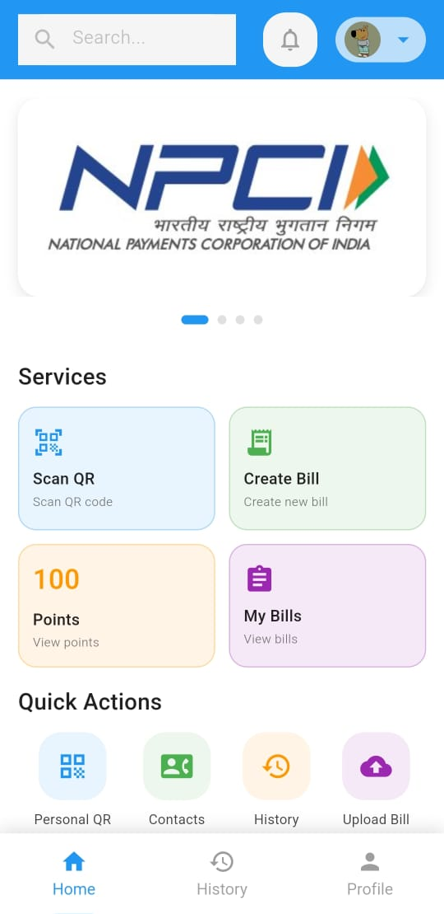

# URS App

## Team: Chill__guys

The URS App is a modern digital payment and billing system designed to provide users with a secure, convenient, and efficient way to manage transactions. The app integrates multiple functionalities, including payment processing, QR code scanning, bill management, and vendor analytics.




---

## Table of Contents
- [Project Structure](#project-structure)
- [Core Features](#core-features)
- [Setup Instructions](#setup-instructions)
- [Database Structure](#database-structure)
- [Future Improvements](#future-improvements)

---

## Project Structure
The application follows a structured organization of files and directories:

```bash
lib/
├── database/
│   ├── database_helper.dart
│   ├── vendor_data_manager.dart
├── models/
│   ├── vendor.dart
│   ├── phone.dart
│   ├── transaction.dart
├── screens/
│   ├── login_page.dart
│   ├── home_page.dart
│   ├── payment_screen.dart
│   ├── qr_scanner_screen.dart
│   ├── transaction_history.dart
│   ├── create_bill.dart
│   ├── my_bills.dart
│   ├── profile_screen.dart
│   ├── settings_screen.dart
├── main.dart
```

---

## Core Features

### Authentication System
- Secure login using Firebase Authentication
- UPI ID addition for seamless payments
- User profile management

### Payment Features
- **QR Code Scanning**: Users can scan vendor-generated QR codes to initiate payments.
- **UPI Payments**: Transactions are processed seamlessly through UPI.
- **Transaction History**: Users can view past payments with details such as amount, vendor name, and date.
- **Bill Management**: Create, store, and categorize bills.
- **Digital Receipts**: Download or share receipts.

### Business Tools
- **Vendor Analytics**: Track earnings and customer spending trends.
- **Customer Reward Points**: Earn points on purchases and redeem rewards.

---

## Setup Instructions

Follow these steps to set up the URS App in your local development environment:

### Prerequisites
Ensure you have the following installed:
- [Flutter SDK](https://flutter.dev/docs/get-started/install)
- [Dart SDK](https://dart.dev/get-dart)
- [Android Studio or VS Code](https://developer.android.com/studio)
- Firebase account with authentication enabled

---
### Refer : [App code Documentataion](https://github.com/AdityaKharmaleGoat7/ECell-x-NPCI-Hackathon/blob/main/App_code_documentation.pdf)
### Demo video of app : [Video](https://github.com/AdityaKharmaleGoat7/ECell-x-NPCI-Hackathon/tree/main/Demo%20video%20of%20app%20working)
### APK of app: [Drive link](https://drive.google.com/file/d/1Imku20th1UopptEuNCiU-2p68y25Y2lH/view?usp=drive_link)
---

### Step-by-Step Setup
1. **Clone the repository**
   ```sh
   git clone https://github.com/AdityaKharmaleGoat7/ECell-x-NPCI-Hackathon.git
   cd ECell-x-NPCI-Hackathon
   ```

2. **Install dependencies**
   ```sh
   flutter pub get
   ```

3. **Configure Firebase**
   - Create a Firebase project.
   - Enable Authentication (Email/Password Sign-In).
   - Download `google-services.json` (for Android) and `GoogleService-Info.plist` (for iOS) and place them in the respective `android/app/` and `ios/Runner/` directories.

4. **Run the app**
   ```sh
   flutter run
   ```

---

## Database Structure
The app uses SQLite for local data storage.

### Vendors Table
Stores vendor details:
- `vendorId`: Unique identifier
- `upiId`: UPI ID
- `name`: Business name
- `type`: Vendor category (small, medium, big)

### Transactions Table
Stores transaction history:
- `transactionId`: Unique transaction identifier
- `amount`: Transaction amount
- `vendorId`: Associated vendor
- `rewardPoints`: Earned reward points

### Bills Table
Stores bills linked to transactions:
- `billId`: Unique bill identifier
- `transactionId`: Associated transaction
- `items`: List of purchased items

---

## Future Improvements
- **Biometric Authentication**: Fingerprint or facial recognition
- **Offline Transactions**: Process payments without internet
- **Advanced Analytics**: Spending insights and vendor reports
- **Draft Button for Bills**: Save bills before finalizing

---

## License
This project is licensed under the MIT License.

---
