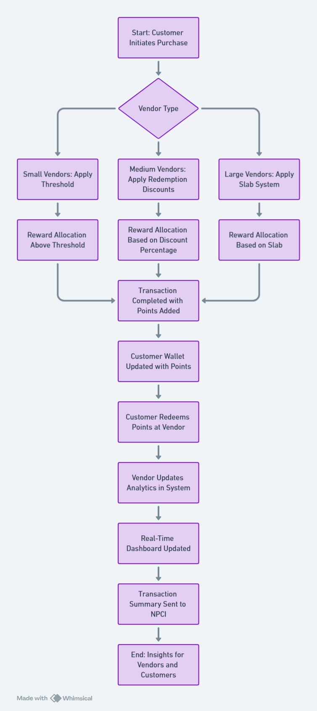
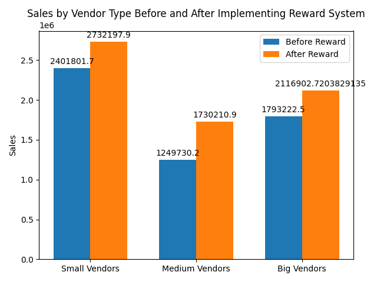

# ECell-x-NPCI-Hackathon  
Business model for NPCI [Hackathon](https://hackathon.ecelliith.org.in/dashboard/portal) organized by Entrepreneurship Cell, IIT Hyderabad  

# Our Solution

Unified Reward System (URS) is a cross-vendor rewards platform integrated with **NPCI** for secure, seamless point accumulation and redemption across multiple retail chains. It benefits both customers and vendors by driving engagement and sales.
[Final Report](https://github.com/AsitDesai/ECell-x-NPCI-Hackathon/blob/main/Final%20Report.pdf)

## 1) [Proof of Concept (PoC)](https://github.com/AsitDesai/ECell-x-NPCI-Hackathon/blob/main/Proof%20of%20Concept.pdf)  

### Unified Reward System for Retail Vendors and Customers  

**Overview**  
- A centralized platform integrating small, medium, and large vendors to enhance customer loyalty and vendor profitability.  
- Customers earn and redeem reward points across vendors via a mobile app.

**Key Features**  
- **Small Vendors**:  
  - Earn points after crossing spending thresholds; points are non-redeemable.  
- **Medium Vendors**:  
  - Redeemable points for discounts on future purchases.  
- **Big Vendors**:  
  - Flexible redemption policies.  
  - Big data insights for customer trends and inventory management.

**Benefits**  
- Drives higher customer spending and repeat visits.  
- Provides actionable insights for vendors via big data analytics.  
- Boosts customer retention with personalized rewards.

---

## 2) [Database Implementation](https://github.com/AsitDesai/ECell-x-NPCI-Hackathon/tree/main/database_implementation)  

### Customer Loyalty and Rewards System  

This Python script demonstrates an in-memory SQLite-based customer loyalty and rewards system, including database creation, data management, and real-time visualizations.  

### Features  
- **Database Setup**: Tables for customers, vendors, transactions, rewards, products, and analytics.  
- **Sample Data**: Pre-filled data for demonstration (5 entries per table).  
- **Visualizations**: Real-time dashboard using `matplotlib`:  
  - Transaction volumes per vendor.  
  - Reward points issued vs. redeemed.  
  - Profitability trends (revenue minus rewards).  

### Key Functions  
- Display tables using `tabulate`.  
- Analyze transactions, rewards, and profitability.  
- Generate bar and line charts for insights.

---

## 3) [Technical Implementation](https://github.com/AsitDesai/ECell-x-NPCI-Hackathon/blob/main/Technical%20Implementation.pdf)  

### Advanced Features and Future Enhancements  

#### Blockchain Integration  
- **Objective**: Enhance security and transparency in the reward system using blockchain.  
- **Features**: Immutable transaction records, transparent point tracking, and secure ledger.  
- **Impact**: Increases trust and reduces fraud.

#### AI-Powered Recommendations  
- **Objective**: Use AI to provide personalized product recommendations based on customer behavior.  
- **Features**: Personalized suggestions, behavioral insights, and increased engagement.  
- **Impact**: Boosts sales and improves customer experience.

#### Multi-Currency Support  
- **Objective**: Enable global support by integrating multiple currencies.  
- **Features**: Currency conversion, automatic adjustments based on exchange rates.  
- **Impact**: Expands the system's reach to international customers.

---

## 4) [Math Proof (Code)](https://github.com/AsitDesai/ECell-x-NPCI-Hackathon/blob/main/math_proof.py)  

### Vendor Reward System Simulation  

**Overview**  
This project simulates customer behavior in a vendor reward system across three types of vendors: Small, Medium, and Big. The goal is to simulate customer transactions before and after the implementation of a reward system, comparing sales and spending behaviors.

**Features**  
- **Before Reward Simulation**: Customers make random transactions with different frequencies and amounts across small, medium, and big vendors.  
- **After Reward Simulation**: A reward system is introduced, where customers earn and redeem points based on their spending, which influences their behavior.  
- **Threshold-Driven Spending**: Customers increase their spending when thresholds are implemented, motivated by potential rewards.  
- **Increased Engagement with Fast Food and Entertainment Sectors**: The simulation reflects increased customer engagement, especially in sectors like fast food chains, with higher spending and frequency due to loyalty programs.

**Key Simulations**  
- **Threshold-Driven Spending**: Customers are incentivized to increase their spending when thresholds are implemented.  
- **Increased Engagement with Fast Food and Entertainment Sectors**: A boost in customer visit frequency and ticket size when loyalty programs are introduced.

**Output**  
- Average sales for each vendor type (Small, Medium, Big) before and after the implementation of the reward system.  
- A bar chart that compares sales before and after the reward system for each vendor type.

**Running the Code**  
Simply run the Python script, and it will simulate the transactions, calculate average sales, and display a bar chart comparing sales before and after the reward system.

---

## 5) [UI Ideation](https://github.com/AsitDesai/ECell-x-NPCI-Hackathon/blob/main/UI%20ideation.pdf)  

### We have shown how our demo frontend for the application will look.
